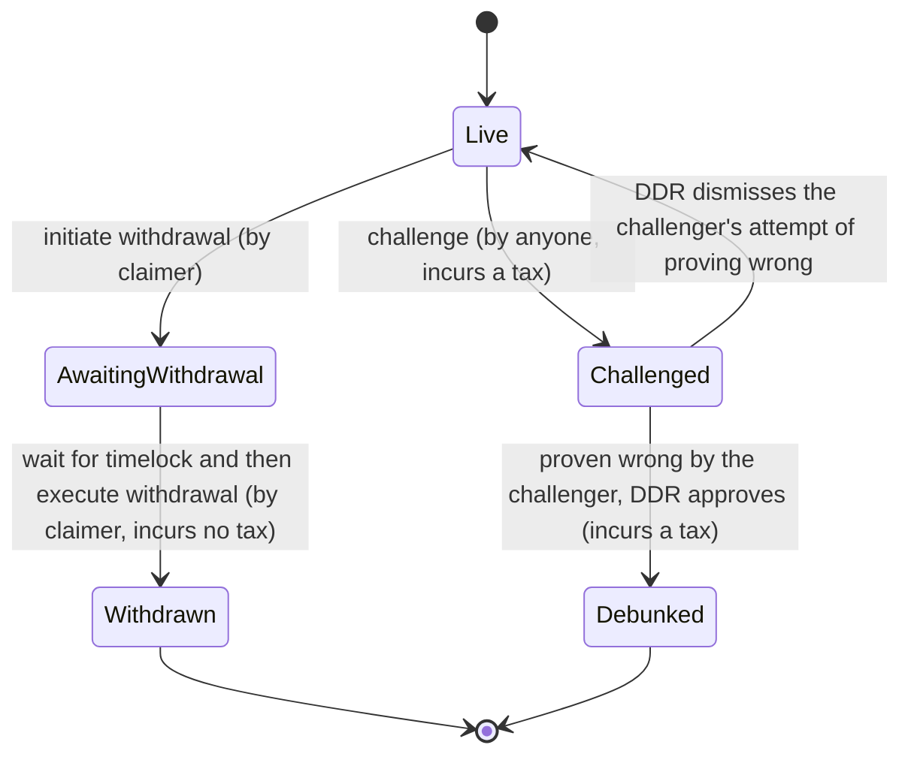

#  Prove Me Wrong: Curating Important Truth out of Falsifiable Claims

## Motivation 

In economics, a public good is a good that is both non-excludable and non-rivalrous. For such goods, users cannot be barred from accessing or using them for failing to pay for them. Also, use by one person neither prevents access of other people nor does it reduce availability to others. Information satisfies these properties. It's non-rivalrous: someone's consumption of a fact doesn't prevent others from consuming it. And it's non-excludable: one can consume a fact even if they haven't paid for it. But, it's not a good by default until it has two more properties: **trueness** and **importance**.

### Trueness and Verifiability vs Falsifiability

To be true, information needs to be filtered of misinformation. But how do we filter out misinformation? One way is to verify each statement (or claim, we will use both words interchangeably from now on). Verifying, however, is impractical since many claims, if not most, in daily life are infeasible to verify. One famous example is the following statement: all swans are white. Proving that "All swans are white" would logically require observing all swans, which is infeasible. In contrast, this claim is [falsifiable](https://en.wikipedia.org/wiki/Falsifiability), because observing a single black swan is sufficient to falsify the claim logically. So it is more practical to look for a refutation instead of a proof.

### Curating What's Important

Even if information is a public good, thus it's free to use, we still pay with time. How to know if consuming a piece of information will worth our time investment? We can see examples of this problem in daily life. We don't watch random movies, we check their reviews, genre and storyline and decide only after that. We don't read random newsletters, magazines. We don't listen to random music, we listen to radios or artists we know. This is how we make sure the time we spend will be worthwhile. It's called curation and curation helps people everyday to invest their time effectively.

But curation has its own problems too. Consumer needs to trust the curator that curation was done as promised and there are no conflicts of interest. For example, in a curated list of restaurants, the consumer has to trust that the curator did not get bribed by a restaurant and that assessments are done fairly.

## Enter Prove Me Wrong

PMW is a solution to curate info for trueness and importance, trustlessly. 

Let's go back to the claim of "All swans are white". We said that it's more practical to look for a refutation instead of verifying. Can we know if a black swan (refutation) will be observed eventually or how long will it take? We can't unless we see all swans. However, we don't have to find a black swan to become confident about the trueness of this claim. We still can be confident about the claim, provided there is adequate incentive to look for a refutation and it's been quite some time and no one was able to find it. And this is what PMW does: estimating the probability of trueness of falsifiable claims (statements). Claims are published with a bounty and they accumulate a trueness score, which is a function of bounty amount and elapsed time. In any time, an item can be challenged by anyone to test it's trueness before a decentralized court (powered by Kleros). The likelihood of observing a refutation is inversely correlated with the trueness score, in other words, more trueness score means less likelihood of a refutation existing. And this actually, is not a novel approach. In bug bounties, if no one was able to discover a bug, after a relatively long time with a relatively big bounty, then we say that the software is practically bug-free. PMW borrows and generalizes this approach to solve curation for trueness.

PMW also uses a cryptoeconomic game played between curators, to achieve trustless curation for importance. This is a game where actors rewarded or punished economically and in which the best strategy is honestly classifying claims according to their importance, with respect to given curation pool policy. This way, curators are incentivized to contribute to public good.

And finally, creators are incentivized by rewards, distributed with respect to importance scores of items'. 

## What Is This Good For?

Some usecases:

- News: consume only true and important news
- Bug Bounties: only if you can address the requirement of private disclosure
- Advertisements: you can have advertisements with credibly true information
- Political Campaigns: get your facts checked trustlessly, gain the trust of public with ease 

## Actions

### To create

To make a falsifiable claim, by offering a security deposit determined by *creator* of the claim.

### To challenge

To challenge a claim, in pursuit of debunking it and winning the bounty. 

### To curate

To categorize claims according to their importance, subjectively.

### To consume

To read statements which are distilled by curation and probabilistic truth filters.

## Actors

### Creators

They make statements (claims) and put a bounty on them for anyone who can prove them wrong. They earn a share from reward pool depending on curation score.

### Inspectors

They look for counter-evidence and if they find challenge statements to win their bounty.

### Curators

Using a token, they vote for statements to curate them for importance. What's important depends on the usecase and the community.

### Readers

Enjoying distilled (true and important) information for free.

## Token Economy (a.k.a. Wen Token?)

As mentioned earlier, to curate importance, PMW will use a cryptoeconomic game, played by curators, where the best strategy of the game is honestly classifying items according to their *importance*, with respect to specific curation pool policy. This will very likely require a token. The token will also help facilitate governance. More on this later.

### Claim (Statement) Lifecycle in State Diagram

Except *Withdrawn* and *Debunked*, in all states, claims accumulate rewards, distribution is weighted according to importance criteria, curated by crowd, using a cryptoeconomic game, as mentioned above. 

