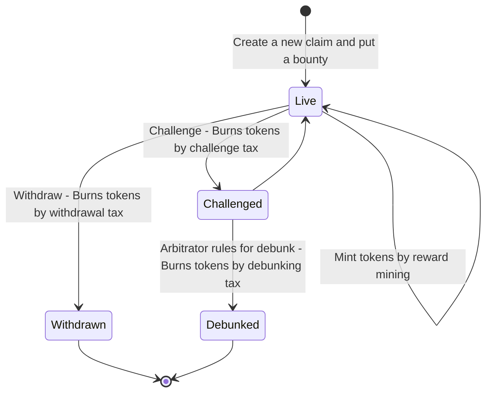

#  Prove Me Wrong: Curating Falsifiable Statements

In economics, a public good is a good that is both non-excludable and non-rivalrous. For such goods, users cannot be barred from accessing or using them for failing to pay for them. Also, use by one person neither prevents access of other people nor does it reduce availability to others. Information satisfies these properties. It's non-rivalrous: someone's consumption of a fact doesn't prevent others from consuming it. And it's non-excludable: one can consume a fact even if they haven't paid for it. But, it's not a good by default until it has two more properties: **trueness** and **importance**.

## Trueness and Verifiability vs Falsifiability

To be true, information needs to be filtered of misinformation. But how do we filter out misinformation? One way is to verify each statement. Verifying, however, is impractical since many statements, if not most, in daily life are infeasible to verify. One famous example is the following statement: all swans are white. Proving that "All swans are white" would logically require observing all swans, which is infeasible. In contrast, observing a single black swan is sufficient to falsify the claim logically. So it is more practical to look for a refutation instead of a proof. Can we know if a black swan (refutation) will be observed eventually? We can't unless we see all swans. But we don't need to know. We still can be confident about the statement because we can estimate its likelihood. And this is what PMW is about: estimating the probability of [falsifiable](https://en.wikipedia.org/wiki/Falsifiability) statements (claims).

## Curating What's Important

Even if information is a public good, thus it's free to use, we still pay with time. How to know if consuming a piece of information will worth our time investment? We can see examples of this problem in daily life. We don't watch random movies, we check their reviews, genre and storyline and decide only after that. We don't read random newsletters, magazines. We don't listen to random music, we listen to radios or artists we know. This is how we make sure the time we spend will be worthwhile. It's called curation and curation helps people everyday to invest their time effectively.

But curation has its own problems too. Consumer needs to trust the curator that curation was done as promised and there are no conflicts of interest. For example, in a curated list of restaurants, the consumer has to trust that the curator did not get bribed by a restaurant and that assessments are done fairly.

To remove the trust requirement from curation, PMW utilizes decentralized dispute resolution via [Kleros](https://kleros.io) and creates a **decentralized curation** for publicizing important information.

## What Is This Good For?

Some usecases:

- News: consume only true and important news
- Bug Bounties: if you address the requirement of private disclosure
- Advertisements: you can have advertisements with true information
- Political Campaigns: gain public trust with ease

## Users Roles

### Claimers

They make statements (claims) and put a bounty on them for anyone who can prove them wrong. They earn a share from reward pool depending on curation score.

### Inspectors

They look for counter-evidence and if they find challenge statements to win their bounty.

### Curators

Using a token, they vote for statements to curate them for importance. What's important depends on the usecase and the community.

### Readers

Enjoying distilled (true and important) information for free.

## Incentive Mechanisms and Token Economy

Creating claims are incentivized by rewards, paid in Prove Me Wrong token (ticker PMW). Claimers will be mining rewards, and this mining amount is a function of curation score and emission rate. Emission rate will be auto-adjusted in each block according to total supply with the target of %10 less total supply compared to each year. This mechanism will make sure token is deflationary and incentivize holding it.

<iframe width="827" height="371" seamless frameborder="0" scrolling="no" src="https://docs.google.com/spreadsheets/d/e/2PACX-1vRoHcFQbJcZRx-a93JrpNrosNdckfBag1u520_8IK6DatKMLIVcOs28-js0dpsnFviB1cqF7pwMJqFb/pubchart?oid=1824803934&amp;format=interactive"></iframe>

Withdrawing a claim, challenging a claim and debunking a claim going to have a tax, which will decrease token supply by buying and burning from market.

### Claim (Statement) Lifecycle

